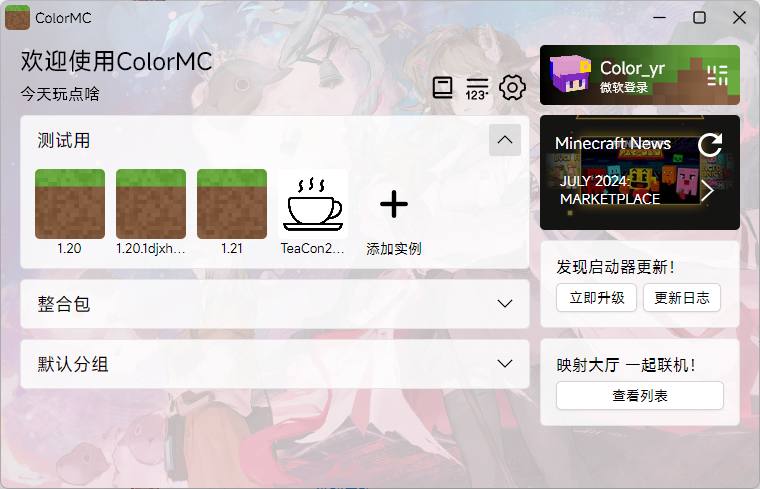
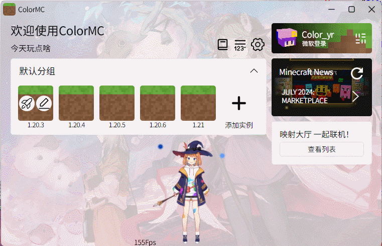

#  ColorMC


**Предупреждение: следующее содержание переведено ChatGPT**.

Мультиплатформенный Minecraft PC-загрузчик.

Используется .NET8 как среда выполнения, XAML как язык интерфейса, и C# как язык для серверной части.

QQ группа: 571239090

Другие языки:
[简体中文](README_EN.md)
[English](README_EN.md)
[Svenska](README_SW.md)
[Français](README_FR.md)

[Руководство пользователя](https://github.com/Coloryr/ColorMC_Pic/blob/master/guide/Main.md) -  
[Журнал изменений](log.md) -  
[Присоединиться к переводу](https://crowdin.com/project/colormc) (Помогите нам!)

## Скриншоты 🪟


**Демонстрационное видео**



## Поддерживаемые платформы
- Linux (предоставляются deb, pkg, rpm)
- Windows
- macOS

**Примечание: Совместимость с платформой ARM64 не гарантируется.  
Из-за сложности дистрибутивов Linux совместимость может различаться. Если приложение не запускается, вам нужно будет устранять проблему самостоятельно. Я протестировал загрузчик только на своей виртуальной машине. Проблемы с совместимостью драйверов не входят в область моей поддержки.**

## Установка
Скачайте предварительно собранные архивы/установочные пакеты из [Releases](https://github.com/Coloryr/ColorMC/releases) или [Actions](https://github.com/Coloryr/ColorMC/actions).  
Распакуйте (zip)/установите (msi, deb, pkg)/или запустите напрямую (appimage).

На Windows можно установить с помощью winget:
```
winget install colormc
```
По умолчанию устанавливается в `C:\Program Files\ColorMC`.

## Запуск

- После установки:  
  На Windows/macOS дважды щелкните по распакованному файлу, чтобы запустить.  
  На Linux можно дважды щелкнуть для запуска или использовать:
```
ColorMC.Launcher
```

- Запуск из исходного кода (необходим .NET8 SDK):
```
git clone https://github.com/Coloryr/ColorMC.git
cd ColorMC/src/ColorMC.Launcher
dotnet run
```

## Сборка из исходного кода

### Сборка Windows-бинарника
**Необходимо собирать на Windows с установленными git и dotnet-8-sdk.**

```cmd
git clone https://github.com/Coloryr/ColorMC.git
cd ColorMC

@REM Обновить исходный код
.\build\update.cmd

@REM Собрать бинарник
.\build\build-windows.cmd
```

### Сборка Linux-бинарника
**Не

обходимо собирать на Linux с установленными git и dotnet-8-sdk.**
```bash
git clone https://github.com/Coloryr/ColorMC.git
cd ColorMC
chmod a+x ./build/update.sh
chmod a+x ./build/build-linux.sh

# Обновить исходный код
./build/update.sh

# Собрать бинарник
./build/build-linux.sh
```

#### Упаковка образов
**Для сборки образов Ubuntu, rpm и Arch используйте соответствующие скрипты для каждой платформы.**

### Сборка macOS-бинарника
**Необходимо собирать на Ubuntu или macOS с установленными git и dotnet-8-sdk.**
```bash
git clone https://github.com/Coloryr/ColorMC.git
cd ColorMC
chmod a+x ./build/update.sh
chmod a+x ./build/build-macos.sh

# Обновить исходный код
./build/update.sh

# Собрать бинарник
./build/build-macos.sh
```

После сборки все бинарники будут находиться в папке `built_out`.

## Разработка

Клонируйте репозиторий:
```
git clone https://github.com/Coloryr/ColorMC.git
git submodule update --init --recursive
```

Основной файл решения: `./src/ColorMC.sln`.

### Использование ядра ColorMC
[Как разработать собственный загрузчик с использованием ядра ColorMC](docs/Core.md)

### Описание проекта
| Модуль              | Описание                             |
|---------------------|--------------------------------------|
| ColorMC.Core        | Ядро загрузчика                      |
| ColorMC.CustomGui   | Пользовательский интерфейс загрузчика [Учебник](docs/CustomGui.md) |
| ColorMC.Cmd         | Режим командной строки (устаревший)   |
| ColorMC.Gui         | Режим GUI                            |
| ColorMC.Launcher    | Основное приложение загрузчика       |
| ColorMC.Test        | Для тестирования загрузчика          |
| ColorMC.Setup       | Для сборки Windows msi-инсталлятора  |

## Зависимости / Используемые проекты
Проект использует несколько зависимостей, включая UI-фреймворки (AvaloniaUI), библиотеки диалоговых окон (DialogHost.Avalonia) и другие. Полные детали можно найти в исходном файле Markdown.

## Лицензия с открытым исходным кодом
Этот проект лицензирован по лицензии Apache 2.0. Подробности можно найти в конце этого файла.

### Инструменты разработки
Рекомендуемые инструменты:
- Visual Studio Code
- Visual Studio 2022
- dotMemory