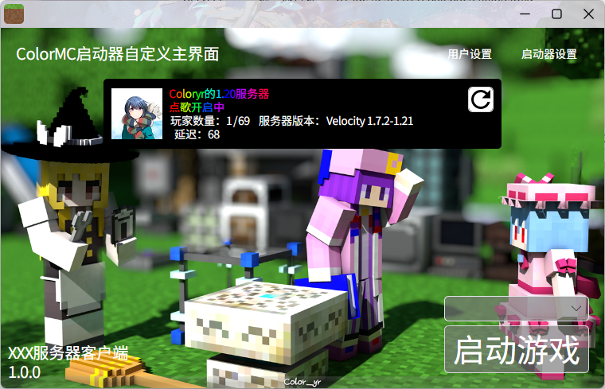
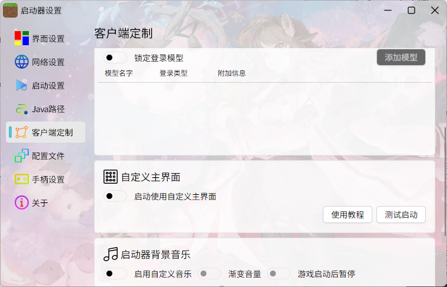

# ColorMC.CustomGui

ColorMC的自定义主界面教程

**ColorMC不会对你写的代码负任何责任**

本操作需要有一定的编程能力，会写[C#](https://dotnet.microsoft.com/zh-cn/languages/csharp)与[XAML界面](https://docs.avaloniaui.net/)

附带的默认自定义主界面  


## 开始

首先克隆代码

```
git clone https://github.com/Coloryr/ColorMC.git

git submodule update --init --recursive
```

使用IDE打开项目`./src/ColorMC.sln`
或者使用VScode打开项目`./src/ColorMC.CustomGui/ColorMC.CustomGui.csproj`

项目里面有几个关键文件
- CustomUI.cs
  这个是引导代码，让启动器去找显示的界面，主要存在一个继承了`ICustomControl`接口的类
- UIControl.axaml
  界面代码，描述界面内容
- UIControl.axaml.cs
  界面后端代码，必须继承类`BaseUserControl`并实现需要的接口
- UIModel.cs
  界面模型代码

自定义主界面强制使用MVVM模式进行编写，但是其他窗口可以不强制使用MVVM模式

## 构建与使用

编写好代码后，进行构建，得到的产物为
- ColorMC.CustomGui.dll
- ColorMC.CustomGui.pdb

将这两个文件放在启动器运行目录(可以在启动器里面打开)
然后在`启动器设置`->`客户端定制`中开启`自定义主界面`功能即可  


## 自动更新自定义主界面

启动器在加载`ColorMC.CustomGui.dll`后不会占用该文件，你可以在自己的代码中加入更新，升级操作